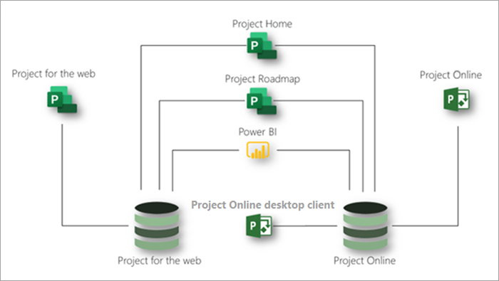

# Описание службы Microsoft ProjectMicrosoft Project service description

## ОбзорOverview

Microsoft Project предоставляет следующие приложения для удовлетворения потребностей Организации в управлении проектами и работами:Microsoft Project offers the following applications to help meet your organization's needs for project and work management:

- Project в ИнтернетеProject for the web
- Project OnlineProject Online 
- Клиент Project Online для настольных ПКProject Online desktop client

Эта статья поможет вам узнать, какие приложения предоставляются в каждой подписке на проект и какие возможности предлагает каждое приложение.This article will help you understand which applications are provided in each Project subscription and what capabilities each application offers.

### Project в ИнтернетеProject for the web

Project for Web — это последнее предложение корпорации Майкрософт по управлению облачными работой и проектами.Project for the web is Microsoft's most recent offering for cloud-based work and project management. Project for Web предоставляет простые и мощные возможности управления работой для удовлетворения большинства потребностей и ролей.Project for the web provides simple, powerful work management capabilities to meet most needs and roles. Руководители проектов и участники групп могут использовать Project для Интернета для планирования и управления работой любого размера.Project managers and team members can use Project for the web to plan and manage work of any size.

Проект для Интернета строится на платформе Microsoft Power.Project for the web is built on the Microsoft Power Platform. Платформа управления питанием состоит из PowerApps, автоматизированного управления питанием, Power BI и общераспространенной службы данных (CD).The Power Platform consists of PowerApps, Power Automate, Power BI, and the Common Data Service (CDS). Project для веб-данных хранится на компакт-диске.Project for the web data is stored in CDS. 

Проект для Интернета доступен по трем подпискам: Project Plan 1, Project Plan 3 и Project Plan 5.Project for the web is available through three subscriptions: Project Plan 1, Project Plan 3, and Project Plan 5. Функции, перечисленные в разделе [Project for Web Features,](#project-for-the-web-features) взаимодействуют только с данными в проекте для хранилища веб-данных.Features listed in the [Project for the web features](#project-for-the-web-features) section interact only with data in the Project for the web data store.

### Project OnlineProject Online
 
Project Online — это гибкое оперативное решение для управления портфелем проектов (PPM) и повседневной работы.Project Online is a flexible online solution for Project Portfolio Management (PPM) and everyday work. Project Online предоставляет широкие возможности управления проектами для планирования, приоритизации и управления проектами и вложениями&mdash;в портфолио проектов практически везде на любом устройстве.Project Online provides powerful project management capabilities for planning, prioritizing, and managing projects and project portfolio investments&mdash;from almost anywhere on almost any device. Project Online может использоваться администраторами, руководителями и обозревателями портфелей, руководителями проектов и ресурсов, руководителями и участниками групп.Project Online can be used by administrators, portfolio managers and viewers, project and resource managers, and team leads and members.

Project Online основан на платформе SharePoint и хранит данные в хранилище данных SharePoint.Project Online is built on the SharePoint platform, and it stores data in the SharePoint data store.

Доступ к Project Online осуществляется по двум подпискам: Project Plan 3 и Project Plan 5.Project Online is available through two subscriptions: Project Plan 3 and Project Plan 5. Функции, перечисленные в разделе " [функции Project Online](#project-online-features) ", взаимодействуют только с данными в хранилище данных SharePoint Online.Features listed in the [Project Online features](#project-online-features) section interact only with data in the Project Online SharePoint data store.

Функции участников группы для Project Online доступны через подписку на Project Online Essentials.Team member functionality for Project Online is available through a Project Online Essentials subscription. Project Online Essentials — это подписка  *на надстройку*члена группы для клиентов, у которых есть подписки на план 3 или Project Plan 5.Project Online Essentials is a team member *add-on* subscription for customers who have Project Plan 3 or Project Plan 5 subscriptions. Он предоставляет членам группы веб-интерфейс для выполнения обновлений задач и времени в проектах, управляемых в Project Online.It gives team members a web interface to perform task and time updates to projects managed in Project Online.

Участники группы с Project Online Essentials могут выполнять следующие функции Project Online:Team members with Project Online Essentials can perform the following Project Online functions:

- Использование веб-интерфейсаUse a web-based interface
- Обновление задач, проблем и рисковUpdate tasks, issues, and risks
- Отправка расписанийSubmit timesheets
- Совместный доступ к документам и совместная работа с Microsoft Teams или пользователями Skype для бизнесаShare documents and collaborate with Microsoft Teams or Skype for Business users

Project Online Essentials не включает проект для веб-сайта.Project Online Essentials does not include Project for the web.

### Клиент Project Online для настольных ПКProject Online desktop client

Клиент Microsoft Project Online для настольных ПК — это программа управления проектами, которая используется для автоматического планирования, управления ресурсами проектов и встроенных отчетов.Microsoft Project Online desktop client is a project management program that features automated scheduling, project resource management, and built-in reporting. Клиент Project Online для настольных ПК можно использовать в качестве автономного приложения или для подключения к Project Online.Project Online desktop client can be used as a standalone application or it can connect to Project Online. Клиент Project Online для настольных ПК — это версия подписки на настольном клиенте Project профессиональный, которая доступна в планах Project 3 и Project Plan 5.Project Online desktop client is the subscription version of the Project Professional desktop client and is available in Project Plan 3 and Project Plan 5 subscriptions.

### Совместное использование Project для Интернета и Project OnlineUsing Project for the web and Project Online together

Несмотря на то, что Project для Интернета и Project Online являются отдельными приложениями, их можно использовать параллельно.Although Project for the web and Project Online are separate applications, you can use them side-by-side. Вы можете видеть все проекты из обоих приложений в Project Home.You can see all your projects from both applications in Project Home. Для построения планов, включающих проекты из обоих приложений, можно использовать функцию плана проекта.You can use the Project Roadmap capability to build roadmaps that include projects from both applications. Вы можете использовать Power BI и Project для пакета содержимого Web Power BI, чтобы получить представление о проектах и ресурсах в двух приложениях. 3And you can use Power BI and the Project for the web Power BI content pack to gain insights into projects and resources across the two applications.3

На этом рисунке показано, как приложения могут совместно работать параллельно.This diagram shows how the applications can work together side-by-side.

В дальнейшем Майкрософт будет сосредоточиться на проектах для веб-нововведений.Going forward, Microsoft will focus on Project for the web innovations. Однако вы можете продолжать использовать Project Online, так как он по-прежнему будет получать основные улучшения производительности и безопасности.However, you can continue using Project Online with confidence as it will continue to receive key performance and security improvements.

## Подписки Microsoft ProjectMicrosoft Project subscriptions

Microsoft Project доступен по трем различным подпискам, чтобы обеспечить соответствие потребностям вашей организации.Microsoft Project is available through three different subscriptions to best meet the needs of your organization. Эти подписки относятся к плану 1, плану проекта 3 и плану проекта 5.These subscriptions are Project Plan 1, Project Plan 3, and Project Plan 5. Чтобы сравнить функции в подписках, ознакомьтесь со статьей [доступность функций в приложениях и подписках](#feature-availability-across-applications-and-subscriptions).To compare features across subscriptions, see [Feature availability across applications and subscriptions](#feature-availability-across-applications-and-subscriptions).

|ПродуктProduct | План 1Plan 1 | План 3Plan 3 | План 5Plan 5 |
|--------|-----------------------------|------------------------|------------------------|
|Project в ИнтернетеProject for the web |**x****x**  | **x x****x x** | **x x****x x** |
|Project OnlineProject Online | |**x x****x x**| **x x x****x x x** |
|Клиент Project Online для настольных ПКProject Online desktop client | |**x****x**|**x****x**|

В приведенной выше таблице число чеков (**x**) показывает общий уровень возможностей, предоставляемых планом.In the table above, the number of checks (**x**) indicates the general level of capabilities provided by a plan. Например, для Project Online план 5 предоставляет больше возможностей, а затем план 3.For example, for Project Online, Plan 5 provides more capabilities then Plan 3.

## Доступность функций в приложениях и подпискахFeature availability across applications and subscriptions

### Project для веб-компонентовProject for the web features

Функции, перечисленные в этом разделе, взаимодействуют только с данными в проекте для хранилища веб-данных.Features listed in this section interact only with data in the Project for the web data store. Все эти функции доступны во всех подписках Microsoft Project: Project Plan 1, Project Plan 3 и Project Plan 5.All these features are available in all Microsoft Project subscriptions: Project Plan 1, Project Plan 3, and Project Plan 5.

|ВозможностьFeature | ОписаниеDescription |
|--------|-------------|
|**Управление проектами, задачами и временем****Project, task, and time management**||
|Представление доскиBoard view | Визуальное отслеживание задач проекта для улучшения мониторинга рабочих процессов и состояния с помощью стандартных и настраиваемых плат задач.Track project tasks visually for improved workflow and status monitoring using out-of-box and custom task boards.|
|ЗависимостиDependencies | Настройка и визуальное отслеживание зависимостей между задачами.Set and visually track dependencies between tasks.|
|Представление "Сетка"Grid view | Планирование и управление проектами с помощью иерархической таблицы представлений задач.Plan and manage projects using a hierarchical grid view of tasks.|
|ВехMilestones | Установите и Отслеживайте важные вехи проекта и задач.Establish and track important project and task milestones.|
|Домашняя страница проектаProject Home | Получите представление о проектах, которые вы недавно работали в Зайцев, а также важных проектах, которые необходимо отслеживать.Get a birds-eye view of projects that you've worked on recently, as well as important projects that you need to monitor closely.|
|Планирование задачTask scheduling | Используйте даты начала и окончания задач, трудозатраты, трудозатраты и зависимости, чтобы получить точное расписание дат проекта.Use task start and end dates, effort, work, and dependencies to get an accurate schedule of project dates.|
|Представление временной шкалы (диаграмма Ганта)Timeline view (Gantt chart) | Визуальное отслеживание и понимание дат, зависимостей и назначений проекта в иерархическом представлении временной шкалы.Visually track and understand project dates, dependencies, and assignments in a hierarchical timeline view.|
|Суммарные задачи.Summary tasks | Планирование, управление и отслеживание конечных результатов и этапов с помощью суммарных задач.Plan, manage, and track deliverables and phases using summary tasks.|
|**Совместная работа****Collaboration**||
|Интеграция Microsoft TeamsMicrosoft Teams integration | Работайте над проектами в Microsoft Teams. 1Collaborate on projects in Microsoft Teams.1|
|**Управление ресурсами и программами****Resource and program management**||
|Настройка группы проектаProject team setup | Управление группой проекта путем добавления и удаления участников и настройки рабочего календаря.Manage a project team by adding and removing members and setting the working calendar.|
|СхемыRoadmaps | Создание визуальных, интерактивных схем в проектах из Microsoft Project Online, Microsoft Project для проектов в Интернете и серверных плат Azure. 2 с планом Project 1 вы получаете доступ к схемам только для чтения.Build visual, interactive roadmaps across projects from Microsoft Project Online, Microsoft Project for the web, and Azure Boards projects.2 With Project Plan 1 you get read-only access to roadmaps. С планом Project (план 3) или с планом 5 можно также создавать планы.With Project Plan 3 or Project Plan 5 you can also create roadmaps. |
|**Отчетность**3**Reporting**3||
|Готовые отчетыOut-of-box reporting | Используйте готовые отчеты для получения информации о проектах, программах, портфеле и ресурсах.Use pre-built reports to understand project, program, portfolio, and resource data.|
|Настраиваемые отчетыCustom reports | Изучите данные, важные для Организации, путем создания настраиваемых отчетов на основе готовых отчетов или "с нуля".Understand the data important to your organization by building custom reports based on out-of-box reports or from scratch.|
|Панели мониторинга и порталыDashboards and portals | Создание настраиваемых панелей мониторинга и порталов для удовлетворения конкретных потребностей Организации.Build custom dashboards and portals to help meet specific organizational needs.|
|**Многократ****Usability**||
|Совместное редактированиеCoauthoring | Совместная работа с заинтересованными лицами и участниками группы для одновременного создания, изменения и обновления списков задач, расписаний проектов и многого другого.Work together with stakeholders and team members to simultaneously build, edit, and update task lists, project schedules, and more.|
|Графические индикаторыGraphical indicators | Сведения о состоянии задачи, назначениях и другие сведения с помощью графических индикаторов.Understand task status, assignments, and more with graphical indicators. |
|**Мобильность****Mobility**||
|Мобильные приложенияMobile applications | Создание настраиваемых мобильных приложений с помощью PowerApps. 4Build custom mobile applications with PowerApps.4 |
|**Настройка и интеграция****Customization and integration**||
|PowerAppsPowerApps | Создание и использование решений для веб-приложений и мобильных устройств с PowerApps. 4Build and consume solutions for web and mobile with PowerApps.4 |
|WorkflowsWorkflows | Автоматизация и интеграция бизнес-процессов с помощью автоматизации управления питанием. 5Automate and integrate business processes with Power Automate.5 |
|Интеграция МайкрософтMicrosoft integration | Работайте в Организации, управляйте документами и другими средствами, используя знакомые средства и приложения Майкрософт. 1Collaborate, manage documents, and more using familiar Microsoft tools and applications.1 |
|**Безопасность и управление пользователями****Security and user management**||
|Современные группы OfficeOffice Modern Groups | Создайте проектную группу для совместной работы с и легко настроит коллекцию ресурсов для совместного использования участниками группы.Build a project team to collaborate with and easily set up a collection of resources for team members to share.|

### Функции Project OnlineProject Online features

Функции, перечисленные в этом разделе, взаимодействуют только с данными в хранилище данных SharePoint Online.Features listed in this section interact only with data in the Project Online SharePoint data store.

|ВозможностьFeature | ОписаниеDescription | План проекта 3Project Plan 3 | План проекта 5Project Plan 5 |
|--------|-------------|-----------------------------|------------------------|
|**Управление проектами, задачами и временем****Project, task, and time management**||||
|Оповещения и напоминанияAlerts and reminders | Будьте в курсе важных задач и событий проектов с напоминаниями в Outlook и Microsoft Teams. 1Stay on schedule for important upcoming tasks and project events with reminders in Outlook and Microsoft Teams.1| ДаYes | ДаYes |
|Базовых показателейBaselines | Настройка базовых планов проекта для отслеживания текущей производительности в сравнении с предыдущими показателями производительности с помощью Project Web App.Set project baselines to monitor current performance against past performance using the Project Web App.| ДаYes | ДаYes |
|Представление доскиBoard view | Визуальное отслеживание задач проекта для улучшения рабочего процесса и наблюдения за состоянием.Visually track project tasks for improved workflow and status monitoring. | ДаYes | ДаYes |
|Критический путьCritical path | Визуально отслеживать задачи, представляющие самый длинный путь в проекте, с помощью Project Web App.Visually track the tasks that represent the longest path through the project using the Project Web App.| ДаYes | ДаYes |
|Управление конечными результатомDeliverable management | Отслеживание конечных результатов и управление ими с помощью дат начала и окончания и автоматического планирования.Track and manage deliverables using start and end dates and automated scheduling.| ДаYes | ДаYes |
|ЗависимостиDependencies | Настройка и визуальное отслеживание зависимостей между задачами.Set and visually track dependencies between tasks.| ДаYes | ДаYes |
|Представление диаграммы ГантаGantt view | Визуальное отслеживание и понимание дат, зависимостей и назначений проекта на иерархической диаграмме Ганта с помощью Project Web App.Visually track and understand project dates, dependencies, and assignments on a hierarchical Gantt chart using the Project Web App.| ДаYes | ДаYes |
|Представление "Сетка"Grid view | Планирование и управление проектами с помощью представления иерархической сетки задач с помощью Project Web App.Plan and manage projects using a hierarchical grid view of tasks using the Project Web App.| ДаYes | ДаYes |
|Управление проблемами и рискамиIssue and risk management | Определите и отслеживайте проблемы и риски на уровне проекта и задачи.Identify and track issues and risks at the project and task level.| ДаYes | ДаYes |
|Главные проекты Master projects | Группировка небольших связанных проектов для одного главного проекта с помощью Project Web App.Group smaller related projects under a single master project using the Project Web App. | ДаYes | ДаYes |
|УведомленияNotifications | Следите за назначениями задач, состояния и важных событий проекта с помощью уведомлений Outlook и Teams. 1Stay on top of task assignments, status, and important project events with Outlook and Teams notifications.1 | ДаYes | ДаYes |
|Домашняя страница проектаProject Home | Получите представление о проектах, которые вы недавно работали в Зайцев, а также важных проектах, которые необходимо отслеживать.Get a birds-eye view of projects that you've worked on recently, as well as important projects that you need to monitor closely.| ДаYes | ДаYes |
|Управление версиями проектовProject versioning | Сравнение различных версий проекта с отчетом, который показывает, что изменилось между версиями.Compare different versions of a project with a report that shows what changed between versions. | ДаYes | ДаYes |
|Суммарные задачи.Summary tasks | Планирование, управление и отслеживание конечных результатов и этапов с помощью суммарных задач в Project Web App.Plan, manage, and track deliverables and phases using summary tasks in the Project Web App. | ДаYes | ДаYes |
|Планирование задачTask scheduling | Использование дат начала и окончания задач, усилий, трудозатрат, зацепок и отставания, а также зависимостей для получения точного расписания дат проекта с помощью Project Web App.Use task start and end dates, effort, work, lead and lag times, and dependencies to get an accurate schedule of project dates using the Project Web App. | ДаYes | ДаYes |
|Обновления задачTask updates | Запись времени и состояния с комментариями к задачам проекта, нерабочее время и нерабочее время.Capture time and status with comments on project tasks, non-project work, and non-working time. | ДаYes | ДаYes |
|СрокиTimelines | Визуальное отслеживание и понимание дат, зависимостей и назначений проекта в представлении временной шкалы с помощью Project Web App.Visually track and understand project dates, dependencies, and assignments on a timeline view using the Project Web App. | ДаYes | ДаYes |
|РасписанияTimesheets | Участники групп могут вводить время и состояние для задач, не связанных с проектом трудозатрат и нерабочего времени.Team members can enter time and status against tasks, non-project work, and non-working time. | ДаYes | ДаYes |
|Утверждения расписанияTimesheet approvals | Участники групп могут отсылать расписания для утверждения.Team members can submit timesheets for approval. Руководители ресурсов и руководители могут просматривать, утверждать и отклонять отправленные расписания.Resource managers and supervisors can review, approve, and decline submitted timesheets. | ДаYes | ДаYes |
|Настройка нерабочего времениNon-working time setup | Добавляйте отпуск, праздники, больничные и другое нерабочее время в график проекта.Add vacation, holidays, medical leave, and other nonworking time into your project schedule. | НетNo | ДаYes |
|**Совместная работа****Collaboration** ||||
|AttachmentsAttachments | Прикрепите документы, изображения и другие файлы на уровне команды, проекта или задачи.Attach documents, images, and other files at the team, project, or task level. Управляйте этими вложениями в Центральной библиотеке на уровне группы или проекта.Manage these attachments in a central library at the team or project level. | ДаYes | ДаYes |
|Внешние участники группыExternal team members |Совместно работать с людьми из других организаций, предоставляя им доступ к своим проектам, задачам и документам. 6Collaborate with people from outside of your organization by granting them access to view and interact with your projects, tasks, and documents.6 | ДаYes | ДаYes |
|Сайты проектовProject sites | Создайте и настройте центр для совместной работы и документов для проекта.Create and customize a hub for collaboration and documents for a project. | ДаYes | ДаYes |
Интеграция Microsoft TeamsMicrosoft Teams integration | Работайте над проектами в Microsoft Teams. 1Collaborate on projects in Microsoft Teams.1 | ДаYes | ДаYes |
|**Управление запросами****Demand management** ||||
|Настройка рабочего процесса утверждения запроса проектаProject request approval workflow setup | Создайте рабочие процессы, необходимые для оценки, определения приоритетов и утверждения входящего спроса.Build the workflows you need to evaluate, prioritize, and approve incoming demand. | НетNo | ДаYes |
|Создание форм запросов проектаProject request forms creation | Запишите важные данные о входящем требовании, чтобы помочь оценить и назначить приоритеты для новой работы.Capture important data about incoming demand to help you evaluate and prioritize new work. | НетNo | ДаYes |
|Запросы проектаProject requests | Отслеживание, управление, оценка и определение приоритетов входящих запросов в Организации и от внешних клиентов и партнеров.Track, manage, evaluate, and prioritize incoming demand from within your organization and from external customers and partners. | ДаYes | ДаYes |
|**Управление ресурсами, программами и портфелями****Resource, program, and portfolio management** ||||
|Расчет себестоимости и бюджетирования проектаProject costing and budgeting | Сравните запланированный прогресс и бюджет с фактическим временем и затратами с помощью Project Web App.Compare planned progress and budget against actual time and costs using the Project Web App. | ДаYes | ДаYes |
|Настройка группы проектаProject team setup | Управление группой проекта путем добавления и удаления элементов, установки уровней размещения и добавления внешних элементов.Manage a project team by adding and removing members, setting allocation levels, and adding external members. | ДаYes | ДаYes |
|Представления емкости ресурсовResource capacity views | Отслеживание емкости ресурсов и управление ею на уровне проекта, группы и Организации.Track and manage resource capacity at the project, team, and organization level. | ДаYes | ДаYes |
|Расчет себестоимости ресурсовResource costing | Отслеживание затрат ресурсов проекта и управление ими.Track and manage the resource costs of your project. | ДаYes | ДаYes |
|Задействование ресурсов (резервирования)Resource engagements (bookings) | Руководители проектов могут отправлять запросы на ресурсы по ролям, навыкам и названиям.Project managers can submit requests for resources by role, skills, or name. Руководители ресурсов могут просматривать запросы и назначать наиболее доступные ресурсы.Resource managers can review requests and assign the best resources available. |Да7Yes7 | Да8Yes8 |
|Планирование мощности ресурсовResource capacity planning | Отслеживание емкости ресурсов и управление ею на уровне проекта, группы и Организации.Track and manage resource capacity at the project, team, and organization level. | НетNo | ДаYes |
|СхемыRoadmaps | Создание визуальных, интерактивных схем в проектах из Microsoft Project Online, Microsoft Project для проектов в Интернете и серверных плат Azure. 2Build visual, interactive roadmaps across projects from Microsoft Project Online, Microsoft Project for the web, and Azure Boards projects.2 | ДаYes | ДаYes |
|Анализ портфелей и определение приоритетовPortfolio analysis and prioritization | Определите, выберите и доставьте портфолио проектов, которые наилучшим образом соответствуют бизнес-стратегиям Организации, и повышайте рентабельность инвестиций.Identify, select, and deliver project portfolios that best align with your organization's business strategy and maximize your return on investment (ROI). | НетNo | ДаYes |
|Панели мониторинга и порталыDashboards/portals | Сведения о состоянии, приоритизации и другие сведения о портфеле, программе, проекте, задаче, Рабочей группе и ресурсе на уровне интерактивных панелей мониторинга в реальном времени.Understand status, prioritization, and more at the portfolio, program, project, task, team, and resource level with real-time interactive dashboards. | ДаYes | ДаYes |
|Work, generic, and material resourcesWork, generic, and material resources | Добавление ресурсов в проект, например рабочих ресурсов, таких как сотрудники, общие ресурсы, такие как "сотрудники", а также ресурсы, такие как компьютеры и цемент.Add resources to a project, such as work resources like people, generic resources like carpenters, and materials resources like computers and cement. | ДаYes | ДаYes |
|**Отчетность**3**Reporting**3 ||||
|Готовые отчетыOut-of-box reporting | Используйте готовые отчеты для получения информации о проектах, программах, портфеле и ресурсах.Use pre-built reports to understand project, program, portfolio, and resource data. | ДаYes | ДаYes |
|Настраиваемые отчетыCustom reports | Изучите данные, важные для Организации, путем создания настраиваемых отчетов на основе готовых отчетов или "с нуля".Understand the data important to your organization by building custom reports based on out-of-box reports or from scratch. | ДаYes | ДаYes |
|Панели мониторинга и порталыDashboards and portals | Создание настраиваемых панелей мониторинга и порталов для удовлетворения конкретных потребностей Организации.Build custom dashboards and portals to help meet specific organizational needs. | ДаYes | ДаYes |
|**Настройка и интеграция****Customization and integration**||||
|Настраиваемая фирменная символикаCustom branding | Настройте развертывание проекта с помощью собственной фирменной символики, логотипа и цветов.Customize your Project deployment using your own brand, logo, and colors. | НетNo | ДаYes |
|Custom fieldsCustom fields | Добавление настраиваемых полей на уровне проекта, задачи и ресурса для отслеживания данных, важных для Организации и проектов.Add custom fields at the project, task, and resource level to track data important to your organization and projects. | ДаYes | ДаYes |
|ФормулыFormulas | Рассчитайте и записывайте важные данные с помощью формул для задач и проектов.Calculate and capture important data using formulas across tasks and projects. | ДаYes | ДаYes |
|PowerAppsPowerApps | Создание и использование решений для веб-приложений и мобильных устройств (через OData) с PowerApps. 4Build and consume solutions for web and mobile (through OData) with PowerApps.4 | ДаYes | ДаYes |
|WorkflowsWorkflows | Автоматизация и интеграция бизнес-процессов (через OData) с помощью автоматизации управления питанием. 5Automate and integrate business processes (through OData) with Power Automate.5 | ДаYes | ДаYes |
|Интеграция с Microsoft 365Microsoft 365 integration | Работайте в Организации, управляйте документами и другими средствами, используя знакомые средства и приложения Майкрософт. 1Collaborate, manage documents, and more using familiar Microsoft tools and applications.1 | ДаYes | ДаYes |
|Интеграция с планировщиком (Майкрософт)Microsoft Planner integration | Присоедините задачи проекта к плану планировщика и отслеживайте подробные сведения о работе в планировщике. 1Connect Project tasks to a Planner plan and track detailed work in Planner.1 | ДаYes | ДаYes |
|**Управление безопасностью, пользователями и службами****Security, user, and service management**||||
|Интеграция с Active DirectoryActive Directory integration | Создавайте Teams из любого участника Active Directory вашей организации. 9Build teams from any member of your organization's Active Directory.9 | ДаYes | ДаYes |
|Управление пользователямиUser management | Управление ролями пользователей и групп, а также разрешениями на уровне проекта, группы и Организации.Manage user and group roles and permissions at the project, team, and organization level. | НетNo | ДаYes |
|Администрирование службыService administration | Планирование, установка и настройка, Обслуживание и расширение среды Microsoft Project в рамках среды Office 3651 .Plan, install and configure, maintain, and extend your Microsoft Project environment as part of your Office 3651 environment.  | НетNo | ДаYes |

#### ЗаметкиNotes

1 требуется коммерческая подписка на Office или Microsoft 365.1 Requires an Office or Microsoft 365 commercial subscription. 
2 платы Azure приобретены отдельно.2 Azure Boards acquired separately. 
3 отчеты по проектам для Интернета и Project Online доступны в Power BI.3 Reporting for Project for the web and Project Online is available using Power BI. Для просмотра, редактирования и создания отчетов требуется подписка Power BI Pro.Viewing, editing, and creating reports requires a Power BI Pro subscription. Корпорация Майкрософт предоставляет готовый набор отчетов Power BI.Microsoft provides a pre-built set of Power BI reports. Пользователи могут настраивать эти отчеты или создавать дополнительные отчеты с помощью Power BI.Users can customize these reports or build additional reports using Power BI.  
4 для создания настраиваемых мобильных приложений PowerApps, обращающихся к проекту для веб-данных, требуется подписка PowerApps, а также подписка на план 3 или план Project (план 5). 
4 Building custom PowerApps mobile applications that access Project for the web data requires a PowerApps subscription and a Project Plan 3 or Project Plan 5 subscription. 
5 Автоматизация и интеграция бизнес-процессов с помощью Power автоматизировать с помощью Project для веб-данных требует подписки на Power автоматизирующие, а также подписки на план 3 или план проекта 5.5 Automating and integrating business processes with Power Automate with Project for the web data requires a Power Automate subscription and a Project Plan 3 or Project Plan 5 subscription. 
6 лицензирование Project Online для внешних пользователей следует той же политике, что и для внутренних пользователей.6 Project Online licensing for external users follows the same policy as that for internal users. Для любого взаимодействия на сайте Project Online требуется подписка на план 3 или план Project (план 5).Any interaction on a Project Online site requires a Project Plan 3 or Project Plan 5 subscription. 
7 пользователи с подпиской на план 3 или Project Plan 5 могут отправлять запросы на задействование ресурсов.7 Users with a Project Plan 3 or Project Plan 5 subscription can submit resource engagement requests. Они не могут просматривать, удовлетворять и утверждать запросы на задействование ресурсов.They cannot review, fulfill, or approve resource engagement requests. 
8 пользователей с подпиской на план Project (план 5) могут просматривать, выполнять и утверждать запросы на задействование ресурсов.8 Users with a Project Plan 5 subscription can review, fulfill, and approve resource engagement requests. 
9 Active Directory требуется отдельная подписка.9 Active Directory requires a separate subscription.  

### Функции клиента Project Online для настольных ПКProject Online desktop client features

|ВозможностьFeature | ОписаниеDescription |
|--------|-------------|
|**Управление проектами и задачами****Project and task management**||
|Базовых показателейBaselines | Настройка базовых планов проекта для отслеживания текущей производительности в отношении прошедшей производительности.Set project baselines to monitor current performance against past performance. |
|Представление календаряCalendar view | Отслеживайте важные сроки проектов и задач и вехи в представлении календаря на неделю или месяц.Track important project and task deadlines and milestones on a weekly or monthly calendar view. |
|Критический путьCritical path | Визуально отслеживать задачи, представляющие самый длинный путь в проекте.Visually track the tasks that represent the longest path through the project. |
|Крайние срокиDeadlines | Установите и Отслеживайте важные крайние сроки проекта и задач.Establish and track important project and task deadlines. |
|ЗависимостиDependencies | Настройка и визуальное отслеживание зависимостей между задачами.Set and visually track dependencies between tasks. |
|Представление диаграммы ГантаGantt view | Визуальное отслеживание и представление дат, зависимостей и назначений проекта в иерархическом представлении Ганта.Visually track and understand project dates, dependencies, and assignments in a hierarchical Gantt view. |
|Представление "Сетка"Grid view | Планирование и управление проектами с помощью иерархической таблицы представлений задач.Plan and manage projects using a hierarchical grid view of tasks. |
|Главные проекты Master projects | Сгруппируйте меньшие связанные проекты в едином главном проекте.Group smaller related projects under a single master project. |
|ВехMilestones | Установите и Отслеживайте важные вехи проекта и задач.Establish and track important project and task milestones. |
|Схема сетиNetwork diagram | Просматривать задачи, зависимости и критический путь проекта в представлении сетевого графика.View tasks, dependencies, and the critical path of your project in a network diagram view. |
|Планирование задачTask scheduling | Использование дат начала и окончания задач, усилий, трудозатрат, зацепок и отставания, а зависимости для получения точного расписания дат проектаUse task start and end dates, effort, work, lead and lag times, and dependencies to get an accurate schedule of project dates |
|Планировщик работы группыTeam planner | Отслеживание распределения и емкости всех участников группы проекта, в том числе нерабочего и нерабочего времени.Track the allocation and capacity of all project team members, including non-project work and non-working time.|
|СрокиTimelines | Визуальное отслеживание и понимание дат, зависимостей и назначений проекта в представлении временной шкалы.Visually track and understand project dates, dependencies, and assignments in a timeline view. |
|Неактивные задачиInactive tasks | Используйте неактивные задачи, чтобы отслеживать работу, не затрагивая доступность ресурсов и выделение, и не затрагивая расписание проекта.Use inactive tasks to track work without affecting resource availability or allocation and without affecting the project schedule. |
|Суммарные задачи.Summary tasks | Планирование, управление и отслеживание конечных результатов и этапов с помощью суммарных задач.Plan, manage, and track deliverables and phases using summary tasks. |
|Инспектор задачTask inspector | Просматривайте факторы, влияющие на планирование задач, такие как изменение даты начала или сообщения об ошибке.View factors that affect the scheduling of a task, such as a changed start date or error messages. |
|Анализ пути к задачеTask path analysis | Отслеживайте связи между задачами, выделяя последовательность задач во всем проекте.See how one task connects to other tasks by highlighting its task path throughout the project. |
|**Управление ресурсами и финансами****Resource and financial management**||
|Resource levelingResource leveling | Устранение конфликтов ресурсов или превышения доступности путем автоматического выравнивания назначений.Resolve resource conflicts or overallocations by automatically leveling the assignments. |
|Work, generic, and material resourcesWork, generic, and material resources | Добавление ресурсов в проект, например рабочих ресурсов, таких как сотрудники, общие ресурсы, такие как "сотрудники", а также ресурсы, такие как компьютеры и цемент.Add resources to a project, such as work resources like people, generic resources like carpenters, and materials resources like computers and cement. |
|Расчет себестоимости и бюджетирования проектаProject costing and budgeting | Сравните запланированный прогресс и бюджет с фактическим временем и затратами.Compare planned progress and budget to actual time and costs. |
|Расчет себестоимости ресурсовResource costing | Отслеживание затрат ресурсов проекта и управление ими.Track and manage the resource costs of your project.|
|**Создание отчетов****Reporting** ||
|Настраиваемые отчетыCustom reports | Создание настраиваемых отчетов для проектов, программ, портфелей и ресурсов.Build custom reports for projects, programs, portfolios, and resources. |
|Готовые отчетыOut-of-box reporting | Используйте готовые отчеты для получения информации о проектах, программах, портфеле и ресурсах.Use pre-built reports to understand project, program, portfolio, and resource data. |
|PDF and XPS outputPDF and XPS output | Сохраните файл проекта в формате PDF или XPS.Save a Project file as a PDF or XPS file. |
|**Многократ****Usability**||
|Автоматическое завершениеAuto-complete | Получение предложений для имен задач или ресурсов и зависимостей по мере их ввода.Get suggestions for task or resource names and dependencies as you type. |
|Отфильтрованные представленияFiltered views | Фильтрация планов проекта по любому значению в планеFilter project plans by any value in the plan |
|Графические индикаторыGraphical indicators | Сведения о состоянии задачи, назначениях и другие сведения с помощью графических индикаторов.Understand task status, assignments, and more with graphical indicators. |
|Многоуровневая отменаMulti-level undo | Одновременное отмена нескольких изменений с помощью меню **отменить** .Undo multiple changes at the same time by using the **Undo** menu. |
|Сортировка и группировкаSorting and grouping | Использование настраиваемой сортировки и группировки для получения отсортированного представления о проекте, задачах и ресурсах.Use custom sorting and grouping to get a focused view of your project, tasks, and resources.|
|**Настройка и интеграция****Customization and integration**||
|настраиваемые поля;Custom fields | Добавление настраиваемых полей на уровне проекта, задачи и ресурса для отслеживания данных, важных для Организации и проектов.Add custom fields at the project, task, and resource level to track data important to your organization and projects. |
|FormsForms | Создание и развертывание настраиваемых форм для записи важных данных проекта.Create and deploy custom forms to capture important project data. |
|ФормулыFormulas | Рассчитайте и записывайте важные данные с помощью формул для задач и проектов.Calculate and capture important data using formulas across tasks and projects. |
|ШаблоныTemplates | Создание шаблонов для стандартных проектов, в том числе планов проектов, команд и назначений.Create templates for common projects including project plans, teams, and assignments. |
|Импорт и экспорт MPP-данных.mpp import/export | Создайте новые проекты из файлов с расширением MPP или создайте файл MPP существующего проекта.Create new projects from existing .mpp files or create an .mpp file of an existing project. |
|Импорт и экспорт ExcelExcel import/export | Создание новых проектов из файлов Excel или создание файла Excel существующего проекта.Create new projects from Excel files or create an Excel file of an existing project. |

## Рекомендации по службамService considerations

> [!NOTE]
> - Проект Франции и Южная &ndash; Корея для Интернета в настоящее время недоступен.France and South Korea &ndash; Project for the web is currently unavailable. Мы работаем над допуском проекта для веб-сайта в вашем регионе и сообщит вам о его доступности через каналы связи, указанные ниже.We're working to deliver Project for the web to your area and will inform you of its availability through the communication channels indicated below.
> - Образовательный &ndash; проект для Интернета скоро будет доступен нашим пользователям для образовательных учреждений.Education &ndash; Project for the web is coming soon to our Education customers. Ожидается точный промежуток времени.An exact timeframe is pending.
> - GCC, GCC High, DoD &ndash; , в настоящее время Project для веба недоступен для GCC, GCC High и DOD.GCC, GCC High, DoD &ndash; Currently, Project for the web is unavailable for GCC, GCC High, and DoD. Мы работаем над разработкой проекта для Интернета, но в настоящее время не удается предоставить общий доступ к определенному периоду.We're working on delivering Project for the web to you, but presently are unable to share a firm timeframe.

### Принципы лицензированияLicensing considerations

- Для любого взаимодействия на сайте Project Online требуется подписка на план 3 или план Project (план 5).Any interaction on a Project Online site requires a Project Plan 3 or Project Plan 5 subscription.
- После истечения срока действия последнего плана проекта 1, Project Plan 3 или Project Plan 5 проект для веб-экземпляров будет удален через 120 дней.When your last Project Plan 1, Project Plan 3, or Project Plan 5 subscription expires, your Project for the web instances will be deleted after 120 days.
- После истечения срока действия последней подписки на план Project 3 или Project (план 5), экземпляры Project Online будут удалены по истечении 120 дней.When your last Project Plan 3 or Project Plan 5 subscription expires, your Project Online instances will be deleted after 120 days.
- Для проектов с пробной версией в Интернете и Project Online пробные экземпляры будут удалены через 30 дней после завершения пробного периода.For Project for the web and Project Online trial subscriptions, your trial instances will be deleted 30 days after your trial period ends.

### Использование SharePoint OnlineUse of SharePoint Online

Для работы с Project Online необходимо использовать SharePoint Online, подготовленный в составе Project Online.Project Online requires the use of SharePoint Online, which is provisioned as part of Project Online. Права на функции SharePoint Online, предоставляемые с подписками Project Plan 3 или Project Plan 5, ограничены хранением и доступом к данным для поддержки Project Online.Rights to the SharePoint Online functionality provided with Project Plan 3 or Project Plan 5 subscriptions are limited to storing and accessing data to support Project Online.

### План проекта и Автоматизация управления питаниемProject Roadmap and Power Automate

Для плана проекта необходимо использовать автоматизацию управления питанием, которая предоставляется в рамках подписки на проект.Project Roadmap requires the use of Power Automate, which is provisioned as part of your Project subscription. Права на функции автоматизации управления питанием ограничиваются функциями автоматизации, необходимыми для плана проекта.Rights to Power Automate functionality are limited to those Power Automate capabilities required by Project Roadmap. Функции автоматизации управления питанием, необходимые для плана проекта, отображаются как **Интеграция данных для проекта с** планом службы обработки данных в разделе **приложения** центра администрирования Microsoft 365.Power Automate functionality required by Project Roadmap appears as the **Data Integration for Project with Flow** service plan in the **Apps** section of the Microsoft 365 admin center.

### Проект для веб-службы и общераспространенной службы данныхProject for the web and Common Data Service

Для работы с проектом в Интернете необходимо использовать общую службу данных (компакт-диски) для хранения данных.Project for the web requires the use of the Common Data Service (CDS) for storing its data. Компакт-диски подготавливаются в составе подписки на проект.CDS is provisioned as part of your Project subscription. Права на доступ к компакт-дискам ограничены хранением и доступом к данным для поддержки проектов в Интернете.Rights to CDS functionality are limited to storing and accessing data to support Project for the web. Функции для работы с компакт-дисками, необходимыми для проекта, отображаются как **Общие службы данных для** плана обслуживания Project в разделе **приложения** центра администрирования Microsoft 365.CDS functionality required by Project appears as the **Common Data Service for Project** service plan in the **Apps** section of the Microsoft 365 admin center.

### Резервное копирование и хранение данныхData backup and retention

Проект для веб-сайта и Project Online имеют те же политики резервного копирования и хранения данных, что и Office 365.Project for the web and Project Online both have the same data backup and retention policy as Office 365. Подробные сведения см. [в статье хранение, удаление и уничтожение данных в Office 365](https://docs.microsoft.com/office365/Enterprise/office-365-data-retention-deletion-and-destruction-overview).For details, see [Data Retention, Deletion, and Destruction in Office 365](https://docs.microsoft.com/office365/Enterprise/office-365-data-retention-deletion-and-destruction-overview).

### Проекты для веб-границ и ограниченийProject for the web boundaries and limitations

Проект для веб-сайта имеет некоторые ограничения, описанные в следующей таблице.Project for the web has some limitations, which are described in the following table.

|Сущность/полеEntity/field | ОграничениеLimit |
|-------------|-------|
|**Задача****Task** ||
|МаксимальнаяMax. уровень иерархии для задачиhierarchy level for task | 10 уровней10 levels |
|МаксимальнаяMax. ссылки (последователя + предшественник) для задачиlinks (successor + predecessor) for a task | двадцать20 |
|МаксимальнаяMax. Продолжительность конечной задачиduration of leaf task | 1250 дней1250 days |
|МаксимальнаяMax. Длительность суммарной задачиduration of summary task | 3650 дней (10 лет)3650 days (10 years) |
|МаксимальнаяMax. ресурсы, которые могут быть назначены задачеresources that can be assigned to a task | 20 ресурсов20 resources |
|Поддерживаемый диапазон дат для задачиSupported date range for task | 1/1/1984 &ndash; 12/31/21491/1/1984 &ndash; 12/31/2149 |
|**Проект****Project** ||
|МаксимальнаяMax. Общее число задач для проектаtotal tasks for the project | 500500 |
|МаксимальнаяMax. Общая длительность проектаtotal duration of the project | 3650 дней (10 лет)3650 days (10 years) |
|МаксимальнаяMax. Общее количество ресурсов для проектаtotal resources for the project | 150150 |
|МаксимальнаяMax. всего ссылок (только последователи) для проектаtotal links (successor only) for the project | 600600 |

### Границы и ограничения Project OnlineProject Online boundaries and limitations

В Project Online есть некоторые ограничения.Project Online has some limitations. Дополнительные сведения см. в статье [Project Online: границы и ограничения программного обеспечения](https://support.office.com/article/5A09DBCE-1E68-4A7B-B099-D5F1B21BA489).For details, see [Project Online: software boundaries and limits](https://support.office.com/article/5A09DBCE-1E68-4A7B-B099-D5F1B21BA489).
